# Hướng dẫn cấu hình Email doanh nghiệp (baolammarketing.com)

Tài liệu này hướng dẫn chi tiết cách cấu hình tài khoản email doanh nghiệp của bạn trên các nền tảng: **Windows (Outlook)**, **iOS (Mail & Gmail)**, và **Android (Gmail)**.

Ngoài ra, bạn cũng có thể truy cập nhanh để gửi/nhận email trực tiếp trên trình duyệt web qua địa chỉ Webmail của công ty: [https://webmail.baolammarketing.com/](https://webmail.baolammarketing.com/)

---

## 1. Thông số cấu hình máy chủ (Bắt buộc)

Dưới đây là thông số chuẩn để thiết lập thủ công tài khoản email của bạn. 

> [!WARNING]
> Vui lòng thay thế phần địa chỉ email mẫu bên dưới bằng **địa chỉ email cá nhân** và **mật khẩu riêng** của bạn do công ty cấp.

| Thông số | Giá trị | Ghi chú |
| :--- | :--- | :--- |
| **Địa chỉ Email (Username)** | `email_cua_ban@baolammarketing.com` | Thay bằng địa chỉ email của bạn |
| **Mật khẩu (Password)** | `<Mật khẩu email của bạn>` | Sử dụng mật khẩu cá nhân của bạn |
| **Giao thức nhận thư** | **IMAP** | Khuyên dùng để đồng bộ thư giữa các thiết bị |
| **Máy chủ thư đến (Incoming Server)**| `mail.baolammarketing.com` | Giữ nguyên cho toàn bộ công ty |
| **Cổng thư đến (IMAP Port)** | **993** | Giao thức: **SSL/TLS** |
| **Máy chủ thư đi (Outgoing Server)**| `mail.baolammarketing.com` | Giữ nguyên cho toàn bộ công ty |
| **Cổng thư đi (SMTP Port)** | **465** | Giao thức: **SSL/TLS** |
| **Yêu cầu xác thực thư đi (SMTP Auth)**| **Có (Checked)** | Sử dụng chung thông tin với máy chủ thư đến |

> [!TIP]
> Nếu cổng thư đi `465` (SSL/TLS) bị chặn bởi nhà mạng hoặc tường lửa thiết bị, bạn có thể thay thế bằng cổng **`587`** với phương thức bảo mật **`STARTTLS`** (hoặc TLS).

---

## 2. Hướng dẫn cấu hình trên Windows (Microsoft Outlook)

Do tên miền không cài đặt cấu hình tự động (Autodiscover), bạn **bắt buộc phải cấu hình thủ công**.

1. Mở **Outlook** -> Chọn **File** (Tệp) -> **Add Account** (Thêm tài khoản).
2. Nhập địa chỉ email của bạn (ví dụ: `email_cua_ban@baolammarketing.com`).
3. Bấm chọn **Advanced options** (Tùy chọn nâng cao) -> Tích chọn **Let me set up my account manually** (Để tôi tự thiết lập tài khoản thủ công).

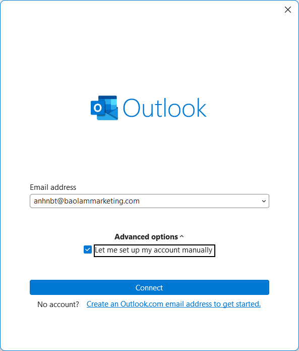
4. Bấm **Connect** (Kết nối) -> Chọn loại tài khoản **IMAP**.
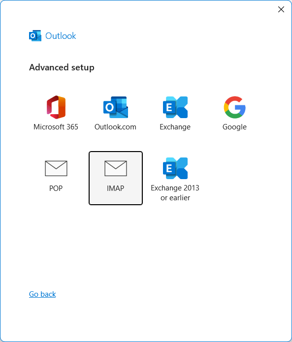

Nếu Outlook chuyển yêu cầu sang giao diện đăng nhập Google thì bấm Cancel

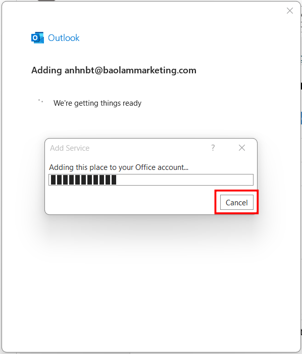

Chọn Change Account Settings.

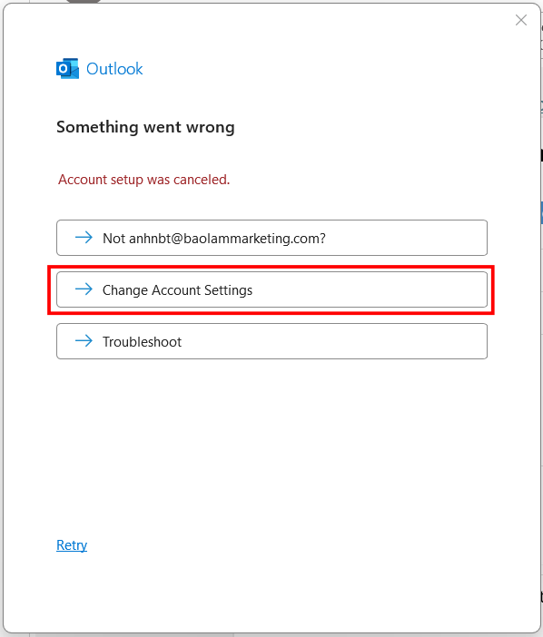
5. Nhập các thông số máy chủ:
   * **Incoming mail:** Server `mail.baolammarketing.com` \| Port `993` \| Encryption: `SSL/TLS`.
   * **Outgoing mail:** Server `mail.baolammarketing.com` \| Port `465` \| Encryption: `SSL/TLS`.

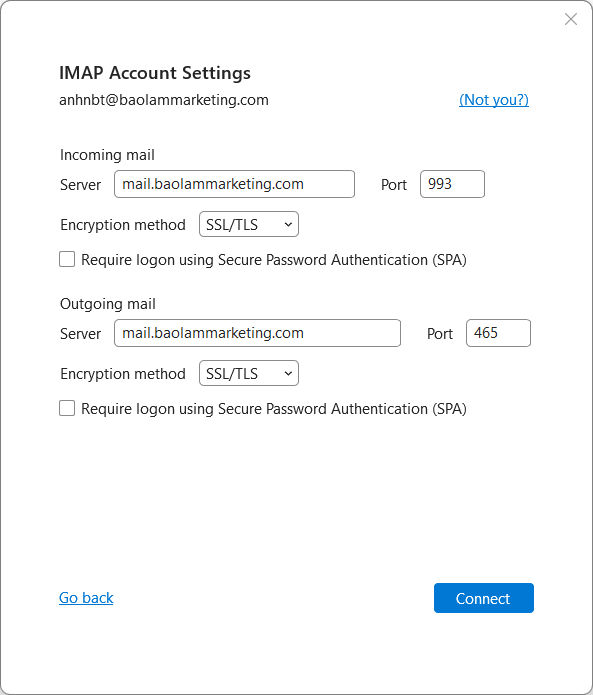

6. Bấm **Next**, nhập mật khẩu cá nhân của bạn và bấm **Connect**.

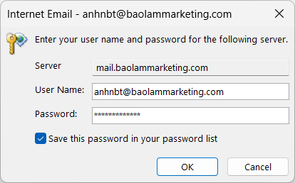

Nhập mật khẩu, bấm OK.

> [!TIP]
> **Cài đặt chữ ký thương hiệu:** Sau khi cấu hình email thành công trên Outlook, bạn có thể xem và sao chép mẫu chữ ký chuẩn thương hiệu Bảo Lâm Marketing tại đây: [Mẫu Chữ Ký Outlook](chu_ky_outlook.html).

---

## 3. Hướng dẫn cấu hình trên iOS (iPhone / iPad)

### Cấu hình trên ứng dụng Gmail trên iOS (Khuyến nghị)
1. Mở ứng dụng **Gmail** -> Bấm vào ảnh đại diện ở góc trên bên phải -> Chọn **Thêm một tài khoản khác** (Add another account).
2. Chọn **Khác** (Other).
3. Nhập email của bạn -> Bấm **Tiếp theo**.
4. Chọn loại tài khoản **IMAP**.
5. Nhập mật khẩu cá nhân của bạn.
6. Ở bước **Cài đặt máy chủ thư đến**, nhập Server: `mail.baolammarketing.com` \| Cổng: `993` \| Loại bảo mật: `SSL/TLS`.
7. Ở bước **Cài đặt máy chủ thư đi**, nhập SMTP Server: `mail.baolammarketing.com` \| Cổng: `465` \| Loại bảo mật: `SSL/TLS` \| Đảm bảo nút **Yêu cầu đăng nhập** được bật và điền đầy đủ Email/Mật khẩu của bạn.

### Cấu hình trên ứng dụng Mail mặc định của iOS
1. Vào **Cài đặt** (Settings) -> **Mail** -> **Tài khoản** (Accounts) -> **Thêm tài khoản** (Add Account).
2. Chọn **Khác** (Other) -> Chọn **Thêm tài khoản Mail** (Add Mail Account).
3. Nhập Tên của bạn, Email của bạn, Mật khẩu của bạn và bấm **Tiếp tục** (Next).
4. Chọn tab **IMAP** (ở góc trên màn hình).
5. Điền thông tin máy chủ:
   * **Máy chủ thư đến (Incoming Mail Server):**
     * Host Name: `mail.baolammarketing.com`
     * User Name: Địa chỉ email cá nhân của bạn
     * Password: Mật khẩu cá nhân của bạn
   * **Máy chủ thư đi (Outgoing Mail Server):**
     * Host Name: `mail.baolammarketing.com`
     * User Name: Địa chỉ email cá nhân của bạn
     * Password: Mật khẩu cá nhân của bạn (bắt buộc nhập)
6. Bấm **Lưu** (Save).
7. **Kiểm tra nâng cao (Nếu thiết bị không tự nhận diện cổng):**
   * Vào lại Cài đặt -> Mail -> Tài khoản -> Chọn tài khoản vừa tạo -> Nhấp vào Địa chỉ Email của bạn -> Chọn **Nâng cao** (Advanced).
   * Đảm bảo **Sử dụng SSL** đang được bật và **Cổng máy chủ** là **`993`**.
   * Quay lại, chọn mục **SMTP** -> Chọn máy chủ chính -> Đảm bảo **Sử dụng SSL** được bật và **Cổng máy chủ** là **`465`** (hoặc `587`).

---

## 4. Hướng dẫn cấu hình trên Android (Ứng dụng Gmail)

Hầu hết các thiết bị Android sử dụng ứng dụng Gmail làm trình quản lý thư mặc định.

1. Mở ứng dụng **Gmail** -> Bấm vào ảnh đại diện ở góc trên -> Chọn **Thêm tài khoản khác** (Add account).
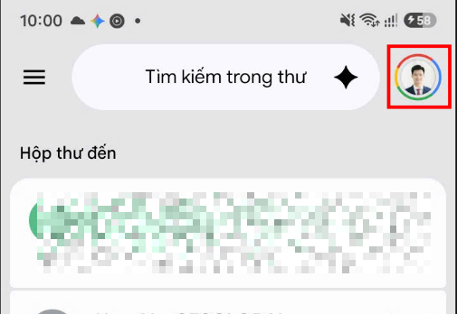
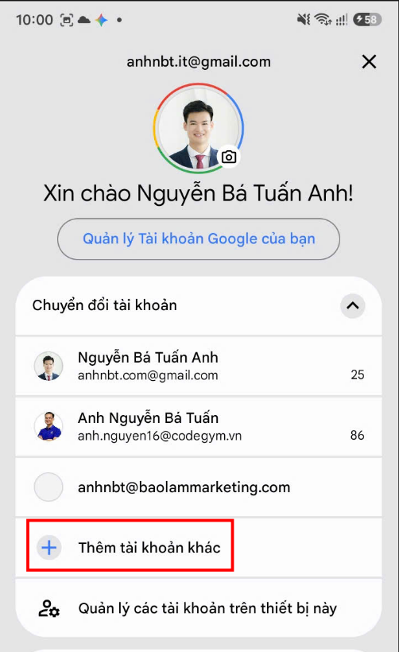
2. Chọn **Khác** (Other).
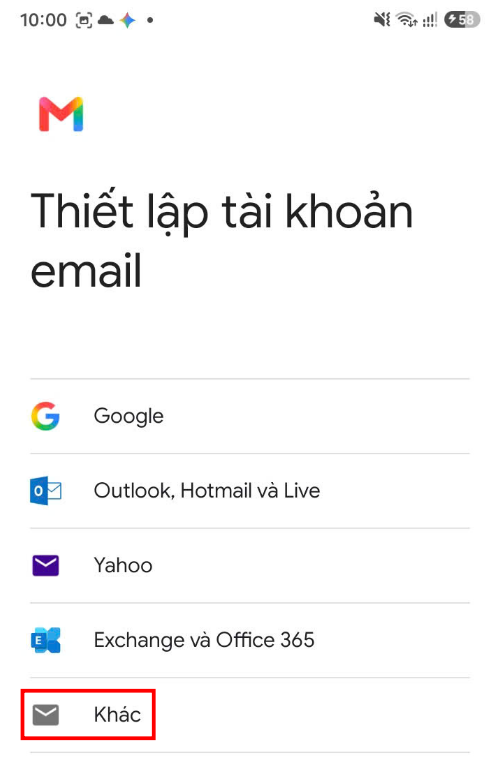
3. Nhập email của bạn.
4. **Không** bấm Tiếp theo ngay, hãy chọn **Thiết lập thủ công** (Manual Setup) ở góc dưới.
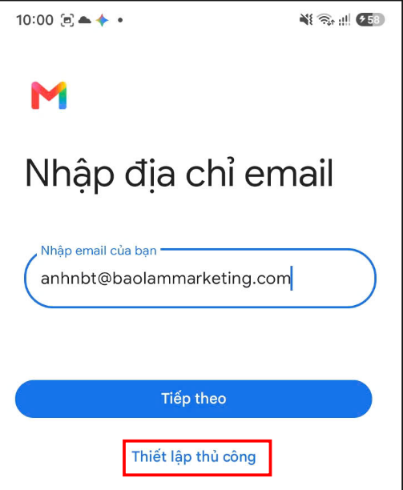
5. Chọn loại tài khoản: **Cá nhân (IMAP)** (Personal IMAP).
6. Nhập mật khẩu cá nhân của bạn -> Bấm Tiếp theo.
7. **Cấu hình Máy chủ thư đến (Incoming server settings):**
   * Người dùng: Địa chỉ email của bạn
   * Mật khẩu: Mật khẩu của bạn
   * Máy chủ (Server): `mail.baolammarketing.com`
   * Cổng (Port): **`993`**
   * Loại bảo mật (Security type): **`SSL/TLS`**
   * Bấm **Tiếp theo**.
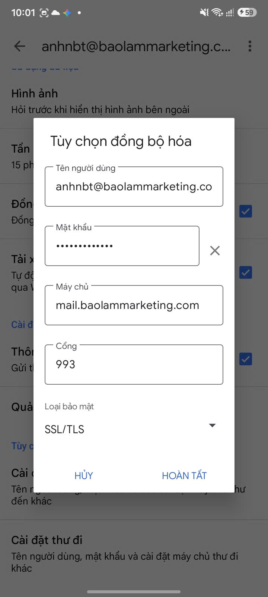
8. **Cấu hình Máy chủ thư đi (Outgoing server settings):**
   * Tích chọn **Yêu cầu đăng nhập** (Require sign-in).
   * Tên đăng nhập: Địa chỉ email của bạn
   * Mật khẩu: Mật khẩu của bạn
   * Máy chủ SMTP (SMTP server): `mail.baolammarketing.com`
   * Cổng (Port): **`465`**
   * Loại bảo mật (Security type): **`SSL/TLS`**
   * Bấm **Tiếp theo**.
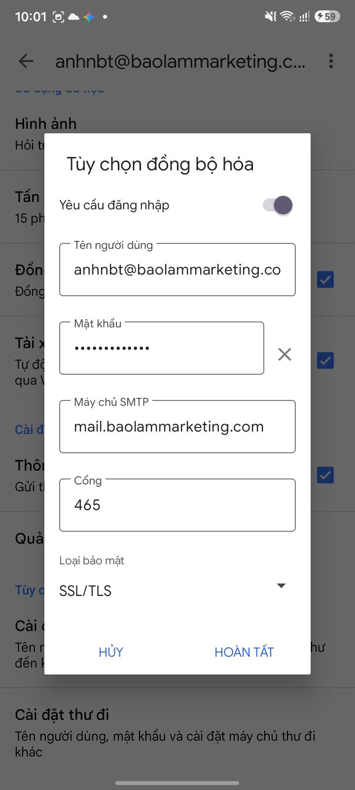
9. Chọn tần suất đồng bộ mong muốn và bấm **Hoàn tất**.
